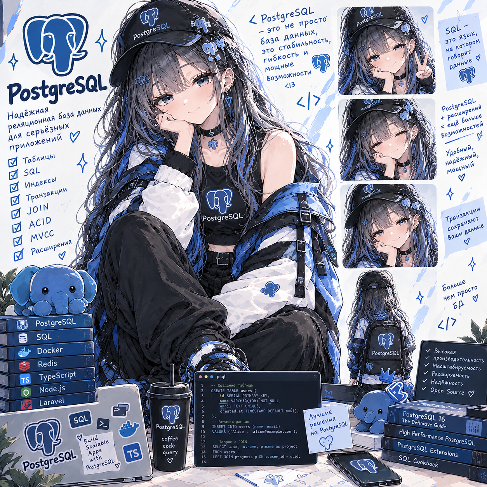

# PostgreSQL Lab — Coffee Shop изнутри

**Статус: ⚪ методичка готова, прохождение впереди.**
**Сложность: средняя–высокая.** Проект полностью самостоятельный (свой репозиторий `postgresql-lab`, только SQL-файлы и `docker-compose.yml`), ни от одной другой лабы не зависит — общая с OOP- и PHP-лабами только идея «кофейни». Входной уровень — «умею SELECT/INSERT»; если JOIN пока «тёмный лес», есть вводная сессия 0. Параллели с Laravel/Eloquent даны по ходу, но фреймворк знать не обязательно.

## О чём

Postgres есть почти в каждой лабе, но везде он был «чёрным ящиком за ORM». Здесь — то, что происходит под ORM, на базе кофейни с реальным объёмом данных (20 кофеен, 100 000 клиентов, 1 000 000 заказов, 2,5 млн позиций, 3 млн событий), чтобы плохой запрос был заметно медленным: устройство Postgres изнутри (процессы, страницы по 8 КБ, shared buffers, WAL, планировщик), чтение `EXPLAIN (ANALYZE, BUFFERS)`, индексы под конкретный запрос (B-tree, составные, частичные, функциональные, покрывающие, GIN, BRIN), статистика и расширенная статистика, N+1 глазами базы, транзакции и уровни изоляции с аномалиями «своими глазами», блокировки и дедлоки, `SKIP LOCKED`, безопасные миграции, MVCC и VACUUM, партиционирование.

## Стек

PostgreSQL 17 в Docker (образ `postgres:17`) + `psql` + `pgbench`. Расширения из образа: `pg_stat_statements`, `pg_trgm`, `pageinspect`, `btree_gist`. Никакого фреймворка и ORM — только база; GUI (DBeaver / DataGrip / TablePlus) по желанию.

## Формат

Методичка [`PostgreSQL_Lab_CoffeeShop.html`](PostgreSQL_Lab_CoffeeShop.html) — открывается в браузере, прогресс по чекбоксам сохраняется локально. У каждого шага: SQL → «Зачем» → «🔬 Под капотом» → «🏋️ Тренировка» с ответами под спойлером → что почитать/посмотреть перед следующим шагом. Главный артефакт — журнал `NOTES.md`: план «до», что сделали, план «после» и почему стало быстрее.

## Что внутри (7 сессий)

- **Сессия 0** — JOIN с нуля на песочнице из пяти клиентов и семи заказов: ключи и NULL, INNER/LEFT/RIGHT/FULL JOIN и ловушка «условие в WHERE», self-join, CROSS JOIN, anti- и semi-join, JOIN + GROUP BY и «размножение» строк
- **Сессия 1** — окружение и данные: Postgres в Docker с инструментами наблюдения, `psql` как рабочее место, схема кофейни, миллион заказов за минуту, SQL-инструментарий (GROUP BY/HAVING, EXISTS, CTE, оконные функции, FILTER, LATERAL), как таблица лежит на диске (страницы, `ctid`, размеры)
- **Сессия 2** — EXPLAIN и B-tree: от Seq Scan на миллион строк до 20 прочитанных записей, составные индексы, статистика, частичные, функциональные и покрывающие индексы, какие индексы удалить
- **Сессия 3** — три алгоритма JOIN и `work_mem`, GIN (триграммы, массивы, jsonb, полнотекстовый поиск), BRIN, расширенная статистика, N+1 через `\gexec` и `pg_stat_statements`, пагинация OFFSET против keyset, охота на медленные запросы (`auto_explain`)
- **Сессия 4** — транзакции и изоляция: потерянное обновление через `pgbench` и три способа починки, Read Committed, Repeatable Read и ошибка 40001, Serializable и write skew, ограничения как последняя линия обороны
- **Сессия 5** — блокировки: `FOR UPDATE`/`NOWAIT`/`lock_timeout`, очередь заказов на `SKIP LOCKED`, дедлок, диагностика через `pg_stat_activity` и `pg_blocking_pids()`, миграции без простоя, advisory locks
- **Сессия 6** — MVCC и VACUUM изнутри (`pageinspect`, `xmin`/`xmax`, раздувание таблицы, долгая транзакция держит горизонт, HOT, wraparound), партиционирование журнала событий, "Production Hell" — задания без подсказок

Разделы 1–8 методички — теория (чего не видно из ORM, как PostgreSQL устроен внутри, архитектура лабы и схема данных, стек и структура, индексы, как читать EXPLAIN, транзакции и блокировки, MVCC/VACUUM/партиционирование/N+1), раздел 9 — семь сессий заданий, разделы 10–13 — чек-лист, глоссарий, вопросы для собеседования, что дальше.

---

Часть сборного репозитория лабораторных работ — [submodule-group-lab](https://github.com/meeymirita/submodule-group-lab).
